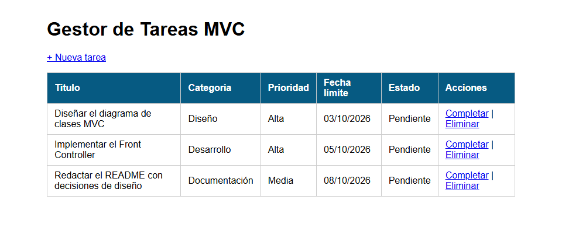
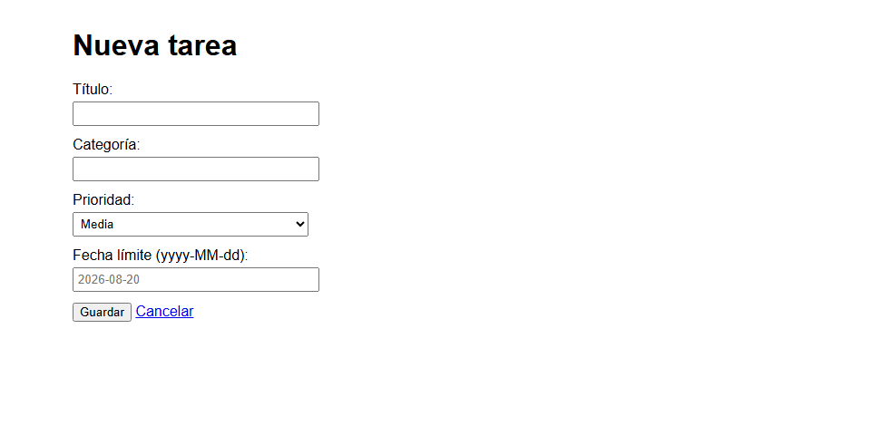
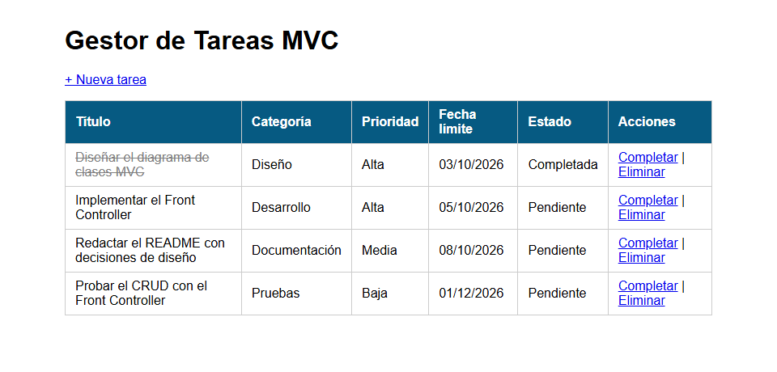
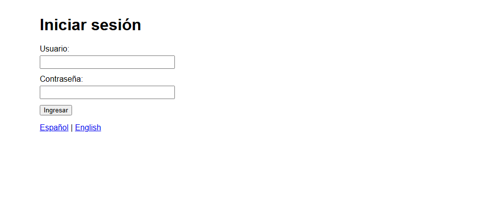
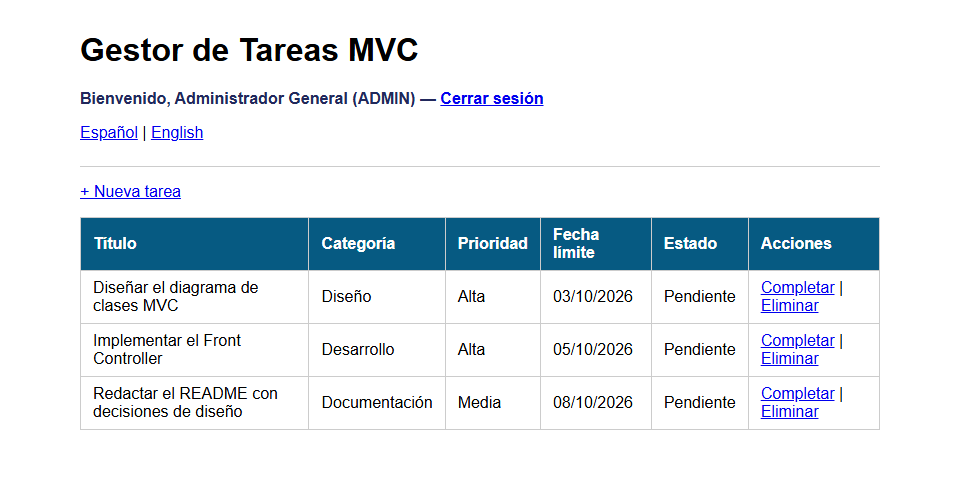
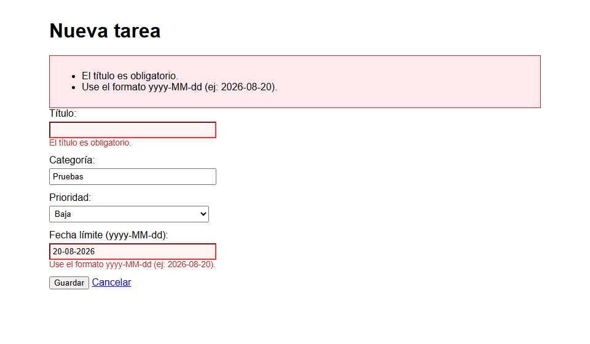
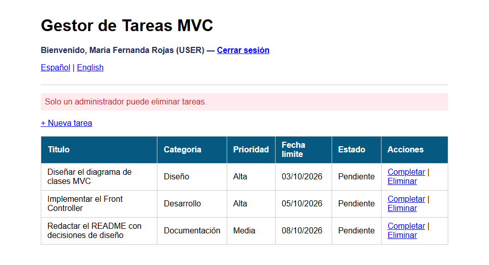
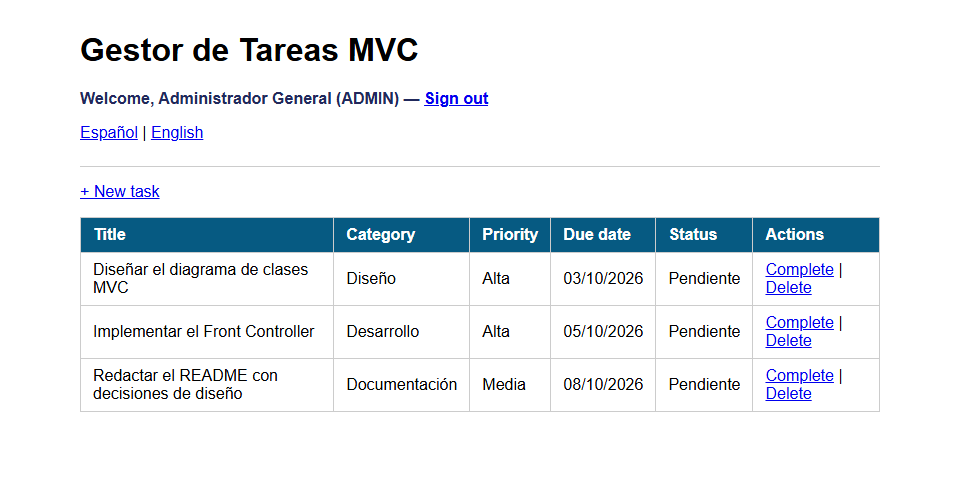
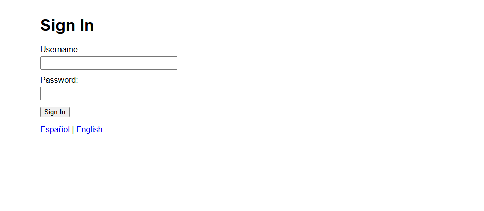

# Post-contenido — Unidad 6: JSP con MVC

## Descripción
Repositorio del laboratorio de la Unidad 6 de Programación Web — Contiene un único proyecto Maven Web (`gestor-tareas-mvc`) que
formaliza el patrón MVC con un Front Controller y el patrón Comando,
extendido con autenticación por sesión con roles, validación por campo
e internacionalización.

## Prerrequisitos
- JDK 17 o superior en el PATH
- Apache Tomcat 10.x (puerto 8080 libre)
- Maven 3.8+
- IntelliJ IDEA (recomendado) o Eclipse IDE for Enterprise Java Developers

## Estructura del proyecto
```
cardenas-post1-u6/
├── pom.xml
├── README.md
├── capturas/                               ← capturas de los checkpoints
└── src/main/
    ├── java/com/ejemplo/mvc/
    │   ├── model/
    │   │   ├── Tarea.java / TareaDAO.java
    │   │   └── Usuario.java / UsuarioDAO.java
    │   ├── service/
    │   │   ├── TareaService.java
    │   │   └── AutenticacionService.java
    │   └── controller/
    │       ├── FrontControllerServlet.java   ← único punto de entrada (/app)
    │       └── comando/
    │           ├── Comando.java
    │           ├── ListarComando.java / FormularioComando.java
    │           ├── GuardarComando.java / EliminarComando.java
    │           ├── CompletarComando.java
    │           └── LoginComando.java / LogoutComando.java / IdiomaComando.java
    ├── resources/
    │   ├── messages.properties              ← inglés 
    │   └── messages_es.properties           ← español
    └── webapp/
        ├── index.jsp
        ├── css/estilos.css
        └── WEB-INF/
            ├── web.xml                      ← context-param de la aplicación
            └── views/
                ├── login.jsp
                ├── lista.jsp
                └── formulario.jsp
```

## Parte 1 — Front Controller y patrón Comando
FrontControllerServlet es el único punto de entrada (`/app`) y delega en
objetos Comando (ListarComando, FormularioComando, GuardarComando,
EliminarComando, CompletarComando). TareaService y TareaDAO separan la
lógica de negocio y el acceso a datos del Controlador. Las vistas usan
JSTL y Expression Language, sin scriptlets.

## Parte 2 — Sesión con roles, validación por campo e i18n
FrontControllerServlet centraliza la verificación de sesión antes de
resolver cualquier comando protegido. LoginComando/LogoutComando
gestionan HttpSession con roles ADMIN/USER; EliminarComando solo
permite el rol ADMIN. GuardarComando valida cada campo del formulario
por separado, usando el límite de longitud del título leído del
contexto de aplicación (web.xml). IdiomaComando guarda la preferencia
de idioma en una Cookie, leída directamente en las vistas con el
objeto EL implícito cookie y ResourceBundle (messages.properties /
messages_es.properties).

## Funcionalidades implementadas
- CRUD de tareas mediante `/app?comando=...`: listar, registrar, completar y eliminar.
- Patrón Post/Redirect/Get: toda operación que modifica datos termina en
  un redirect a `/app?comando=listar`.
- `/app` sin parámetro `comando` carga el listado (o el login si no hay sesión).
- Login y logout con HttpSession (expira tras 30 minutos de inactividad).
- Roles ADMIN y USER: solo ADMIN puede eliminar tareas.
- Validación en el servidor con un mensaje por campo (título obligatorio
  y de máximo 80 caracteres, categoría obligatoria, prioridad válida,
  fecha con formato `yyyy-MM-dd` y no pasada) y repoblado del formulario.
- Selector de idioma español/inglés persistido en una cookie de 30 días.

## Usuarios de prueba
| Usuario | Contraseña | Rol |
|---|---|---|
| `admin` | `Admin123!` | ADMIN |
| `maria` | `Maria2026!` | USER |

## Cómo compilar y desplegar
1. Clonar el repositorio: `git clone https://github.com/Moisex006/cardenas-post1-u6.git`
2. Abrir la carpeta como proyecto Maven en IntelliJ IDEA
3. Ejecutar `mvn clean package`
4. Configurar Tomcat Server (Local) en el IDE y desplegar el artefacto
   war exploded de `gestor-tareas-mvc` (o copiar el `.war` de `target/`
   a `webapps/` como `gestor-tareas-mvc.war`)
5. Abrir `http://localhost:8080/gestor-tareas-mvc/app`

## Cómo probar cada parte
**Parte 1:** entrar a `/app` (con la Parte 2 primero se inicia sesión),
usar "+ Nueva tarea" para registrar una tarea, "Completar" para tacharla
y "Eliminar" para borrarla, confirmando el diálogo.

**Parte 2:**
1. Abrir `/app?comando=listar` sin sesión: redirige a `/app?comando=login`.
2. Probar una contraseña incorrecta: aparece el error en el login.
3. Entrar como `admin`: el saludo muestra el nombre y el rol, y Eliminar funciona.
4. Entrar como `maria` e intentar eliminar: aparece el mensaje de restricción.
5. Guardar el formulario con el título vacío y una fecha como `20-08-2026`:
   aparece un error junto a cada campo y se conservan los demás valores.
6. Hacer clic en "English", cerrar sesión: el login sigue en inglés.

## Decisiones de diseño
- El Comando devuelve la vista lógica (o null si ya hizo un redirect)
  en vez de invocar el forward directamente, para que
  FrontControllerServlet concentre esa llamada en un solo lugar.
- Se usó un Front Controller en vez de un Servlet por acción para que
  la verificación de sesión de la Parte 2 se agregara una sola vez,
  en procesar(), sin copiarla al inicio de cada Servlet.
- El nombre de usuario y el rol viven en HttpSession porque deben
  expirar con la sesión; el idioma vive en una Cookie porque debe
  sobrevivir al cierre de sesión (Guía, tabla comparativa 5.4).
- La longitud máxima del título de una tarea se lee del contexto de
  aplicación (context-param en web.xml) en vez de codificarse como
  literal en GuardarComando, para poder cambiar la regla sin
  recompilar.
- La validación por campo acumula los errores en un `Map` ordenado
  (`LinkedHashMap`) con el nombre del campo como clave: así la vista
  muestra todos los errores a la vez, cada uno junto a su campo, y
  repuebla lo que el usuario ya había escrito.

### Ajustes respecto al código de la guía (calidad y seguridad)
Para que el proyecto pase el quality gate de SonarCloud (Security y
Reliability A) y no falle con entradas inesperadas, se hicieron estos
ajustes sin cambiar la funcionalidad:
- `doGet`/`doPost` capturan `ServletException`/`IOException`: el error se
  registra con `log()` y se responde 500 sin exponer el stack trace.
- El `id` de completar, eliminar y formulario se lee con
  `Comando.leerId()`: un valor ausente o no numérico se ignora en vez de
  lanzar `NumberFormatException`.
- `IdiomaComando` redirige siempre a `/app` en lugar de al encabezado
  `Referer`, que lo controla el cliente y permitiría una redirección
  abierta hacia otro sitio. El resultado es el mismo: con sesión se ve
  la lista y sin sesión el login. La cookie se marca `HttpOnly` (las
  vistas la leen en el servidor) y `Secure` cuando la petición es HTTPS.
- `EliminarComando` comprueba que la sesión exista antes de leer el
  usuario, en vez de suponerlo.
- `TareaDAO` comparte sus datos entre todos los hilos, por eso usa
  `CopyOnWriteArrayList` y `AtomicInteger`.
- La fecha se analiza en modo estricto (`setLenient(false)`): sin él,
  `SimpleDateFormat` aceptaba `01-12-2026` como una fecha del año 7. Una
  fecha ausente se valida antes de analizarla, en vez de capturar
  `NullPointerException`.
- Los campos de los formularios tienen `id` y su `<label for>`.
- `index.jsp` redirige con `<c:redirect>` (JSTL) en vez de un scriptlet.

## Capturas de pantalla

### Parte 1
Listado inicial con las 3 tareas precargadas:



Formulario de nueva tarea:



Tarea registrada (tras el redirect a `/app?comando=listar`) y primera tarea completada:



### Parte 2
Login:



Listado con el saludo de sesión del administrador:



Formulario con validaciones por campo (título vacío y fecha inválida):



Restricción de rol al eliminar con el usuario `maria` (USER):



Selector de idioma en inglés:



El idioma se mantiene después de cerrar sesión, porque vive en una cookie:


